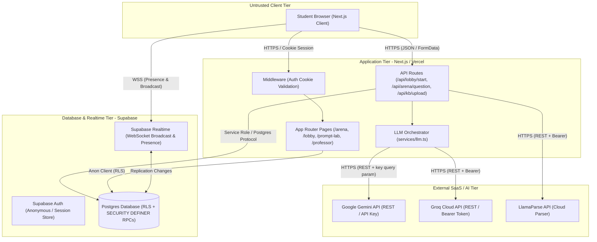

---
agent-notes:
  ctx: "STRIDE threat model, trust boundaries, and attack surface inventory"
  deps: ["docs/code-map.md", "supabase/migrations/20260916000000_fix_raid_race_conditions.sql"]
  state: canonical
  last: "pierrot@2026-09-20"
  key: ["Pierrot owns, Archie contributes DFDs", "RAG prompt injection & anonymous session boundaries"]
---
# Threat Model

**Project:** PromptRoyale  
**Last reviewed:** 2026-09-20  
**Reviewed by:** Pierrot, Archie  

## System Overview

PromptRoyale is a gamified AI study and quiz arena where students form collaborative squads (2–4 players), discuss questions in real-time chat, and defeat AI bosses using knowledge extracted from uploaded course materials. 

Key architectural components:
- **Authentication:** Anonymous and guest sessions managed via `@supabase/ssr` HTTP-only encrypted cookies and Supabase Auth.
- **Course Ingestion & RAG:** Course documents (PDFs, slides, text) are uploaded via `/api/kb/upload` or `/api/jobs/upload`, parsed via LlamaParse / OCR extraction, chunked, and embedded into pgvector embeddings in Supabase (`knowledge_base` table).
- **LLM Synthesis & Arena Quizzes:** Server-side LLM orchestrator (`services/llm.ts`) uses Google Gemini API (with Groq and static fallbacks) to dynamically generate grounded quiz questions, prompt restyling, query expansion, and revive questions.
- **Raid Coordination:** Real-time lobby and arena synchronization powered by Supabase Realtime (WebSocket channels) and Postgres transactional RPCs (`start_raid`, `resolve_raid_round`).

## Data Flow Diagram

## Trust Boundaries

| Boundary | Description | Threats | Controls & Mitigations |
|----------|-------------|---------|------------------------|
| **TB-1: Anonymous / Guest Auth Boundary** (`@supabase/ssr` Cookie Session) | Student browsers interact with the system via guest/anonymous auth cookies managed by `@supabase/ssr`. | Session hijacking, cookie tampering, anonymous user flooding, Sybil squad manipulation. | Secure HTTP-only cookies, PKCE verification (`/auth/callback`), session refresh in Next.js edge middleware (`updateSession`), rate limiting on public endpoints. |
| **TB-2: Ingestion & RAG Prompt Injection Boundary** (`/api/kb/upload` → LlamaParse / Gemini → LLM Synthesis) | User-supplied documents (PDFs, notes) are parsed by external tools and stored as text chunks, which are subsequently interpolated into system and user prompts during quiz and synthesis generation. | Indirect Prompt Injection (malicious course notes hijacking boss prompts, leaking system prompts, or forcing incorrect quiz grading), SSRF, malicious PDF parser exploits. | File mime-type/size validation, bearer token authentication (`NEXT_PUBLIC_API_SECRET_TOKEN`), strict LLM prompt framing (delimited XML/markdown chunks with explicit refusal instructions), JSON-schema response validation. |
| **TB-3: Game State & Squad Write Boundary** (Supabase RLS & Server-Side RPCs) | Squad creation and round damage resolution directly affect arena state and leaderboards. Client cannot write directly to `squads` or `squad_members`. | Unauthorized state manipulation, race conditions, double-damage attacks, forged host actions. | Public INSERT policies dropped on `squads` and `squad_members`. All squad lifecycles restricted to server-side `SECURITY DEFINER` RPCs (`start_raid`, `resolve_raid_round`) with advisory locks (`pg_advisory_xact_lock`) and idempotency checks (`last_resolved_round`). |
| **TB-4: LLM API Key Boundary** (Server → Gemini REST API) | Secret API keys (`GEMINI_API_KEY`, `GROQ_API_KEY`) authenticate upstream AI requests. Keys are transmitted as URL query parameters in Gemini v1beta endpoints. | API key leakage in egress logs, proxy snooping, unauthorized billing exhaustion. | API keys stored in server environment variables only (never exposed via `NEXT_PUBLIC_*`). HTTPS transport layer encryption. Upstream quota caps and multi-tier fallbacks (Gemini → Groq → Static). |

## Assets

| Asset | Classification | Storage | Impact if Compromised |
|-------|---------------|---------|----------------------|
| **LLM & Cloud API Keys** (`GEMINI_API_KEY`, `GROQ_API_KEY`, `LLAMA_CLOUD_API_KEY`) | Restricted / Secret | Vercel / Server Environment Variables | Unauthorized billing consumption, API quota denial-of-service, external API abuse. |
| **Supabase Service Role Key** (`SUPABASE_SERVICE_ROLE_KEY`) | Restricted / Critical Secret | Vercel / GitHub Secrets | Full database compromise, arbitrary read/write bypassing all RLS policies. |
| **Course Knowledge Base** (`knowledge_base`, `embeddings`) | Confidential | Supabase Postgres (`pgvector`) | Leaked unreleased academic exams, intellectual property violation. |
| **Squad & Raid State** (`squads`, `squad_members`) | Internal / Game State | Supabase Postgres | Cheating, corrupted leaderboards, game loop desynchronization. |
| **Session Cookies & Tokens** | Confidential | HTTP-only Cookies / Supabase Auth | Account impersonation within active raid sessions. |

## STRIDE Analysis

### Spoofing (Identity)

| Component | Threat | Likelihood | Impact | Mitigation | Status |
|-----------|--------|------------|--------|------------|--------|
| Client Session | Malicious actor generates forged session tokens to impersonate player. | Low | Medium | Cryptographically signed `@supabase/ssr` cookies verified against Supabase Auth. | Mitigated |
| Lobby Host | Non-creator claims host authority to prematurely start raid or tamper settings. | Medium | Low | Server-side validation in `start_raid` RPC requiring valid host ID and minimum 2 members; `host_player_id` enforced in DB. | Mitigated |

### Tampering (Data Integrity)

| Component | Threat | Likelihood | Impact | Mitigation | Status |
|-----------|--------|------------|--------|------------|--------|
| Raid Game State | Client sends forged round damage or repeats resolution requests to defeat boss instantly. | High | High | `resolve_raid_round` RPC uses advisory transaction locks and `last_resolved_round` idempotency check; direct INSERT/UPDATE revoked. | Mitigated |
| Course Knowledge Base | Student uploads poisoned text chunks designed to alter quiz generation logic. | Medium | Medium | Ingestion restricted to authenticated professor roles / bearer token; system prompts instruct LLM to strictly adhere to chunk bounds. | Mitigated |

### Repudiation (Accountability)

| Component | Threat | Likelihood | Impact | Mitigation | Status |
|-----------|--------|------------|--------|------------|--------|
| Raid Completion | Disputed match outcome between squad members. | Low | Low | Server-side database transactions record round outcomes and timestamps in `squads` table. | Mitigated |

### Information Disclosure (Confidentiality)

| Component | Threat | Likelihood | Impact | Mitigation | Status |
|-----------|--------|------------|--------|------------|--------|
| LLM API Keys | Exposure of `GEMINI_API_KEY` to client browser. | High (if misused) | High | Client bundles contain zero LLM keys; all LLM operations run exclusively via server API routes. | Mitigated |
| Course Content | Unauthorized students accessing draft/unreleased course modules. | Medium | Medium | Supabase RLS enforces read policies scoped by course ID. | Mitigated |

### Denial of Service (Availability)

| Component | Threat | Likelihood | Impact | Mitigation | Status |
|-----------|--------|------------|--------|------------|--------|
| Ingestion Endpoint | Unbounded file uploads exhausting server disk or memory. | High | Medium | 10MB payload size limits, in-memory stream processing, and rate limiting in middleware. | Mitigated |
| LLM Rate Quota Exhaustion | High concurrency raid matches exhausting upstream Gemini API quota. | High | Medium | Multi-model fallback chain (`gemini-3.5-flash`, `gemini-flash-latest`, `gemini-2.5-flash-lite`, Groq `llama3-8b-8192`, static fallback questions). | Mitigated |

### Elevation of Privilege (Authorization)

| Component | Threat | Likelihood | Impact | Mitigation | Status |
|-----------|--------|------------|--------|------------|--------|
| Knowledge Base Upload | Unauthenticated guest uploading arbitrary course data. | Medium | High | `NEXT_PUBLIC_API_SECRET_TOKEN` bearer auth header check in `/api/kb/upload` and `/api/jobs/upload`. | Mitigated |
| Direct DB Mutation | Anonymous client executing arbitrary SQL or table mutations. | High | Critical | Supabase Row Level Security (RLS) enabled on all tables; write access restricted to `SECURITY DEFINER` RPCs. | Mitigated |

## Attack Surface Inventory

| Surface | Protocol | Auth Required? | Exposed To | Notes |
|---------|----------|----------------|------------|-------|
| `/api/lobby/start` | HTTPS POST | No (Guest/Anon) | Public Internet | Server-side validation verifies host and squad membership; executes `start_raid` RPC. |
| `/api/arena/question` | HTTPS POST | No (Guest/Anon) | Public Internet | Fetches course context chunks and calls server-side LLM for grounded question generation. |
| `/api/kb/upload` | HTTPS POST | Yes (Bearer Token) | Public Internet | Multipart upload for course materials; protected by API secret token. |
| `/api/health` | HTTPS GET | No | Public Internet | Lightweight status probe for Vercel/uptime monitors; returns status and timestamp. |
| `Supabase Realtime` | WSS | Anon JWT | Public Internet | Realtime presence and postgres_changes broadcast channels scoped by `squad_id`. |

## Open Risks

| Risk | Severity | Rationale for Acceptance | Review Date |
|------|----------|--------------------------|-------------|
| Gemini API Key in URL Query Parameter | Low | Google Gemini REST API v1beta protocol requires `?key=` query parameter on API invocations; mitigated by strict TLS and server-side invocation. | 2026-12-01 |
| Anonymous Guest Rate Abuse | Medium | In-memory token-bucket rate limiter mitigates bursts per-IP, but distributed bot attacks require future edge WAF / Cloudflare integration. | 2026-12-01 |
